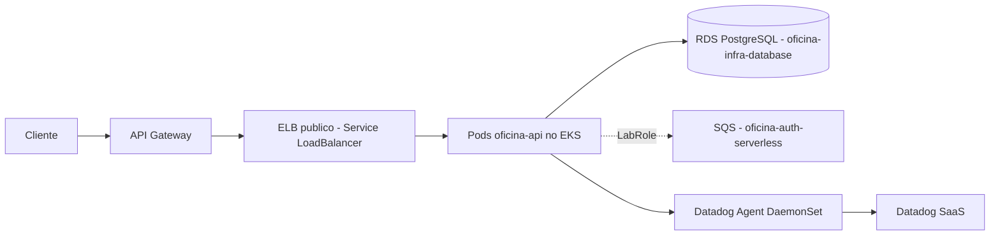

# oficina-infra-kubernetes

Infraestrutura Kubernetes (Amazon EKS) e observabilidade Datadog da Oficina API, provisionada com **Terraform** e executada no **AWS Academy Learner Lab**.

É um dos quatro repositórios do Tech Challenge Fase 3:

| Ordem de deploy | Repositório | Responsabilidade |
| --- | --- | --- |
| 1 | **oficina-infra-kubernetes** (este) | VPC/EKS/node group, ECR, metrics-server, Datadog Agent, dashboards e monitores |
| 2 | `oficina-infra-database` | RDS PostgreSQL gerenciado + Secret de conexão |
| 3 | `oficina-auth-serverless` | Lambda de autenticação por CPF + API Gateway + JWT |
| 4 | `oficina-api` | Aplicação NestJS, imagem, deploy no EKS, migrations |

## Descrição

Provisiona a base de computação da solução:

- **VPC:** usa a VPC *default* do Learner Lab (o lab não permite criar VPC Flow Log role; NAT tem custo alto).
- **EKS 1.32** com um managed node group (`t3.medium`, 2–4 nós) — recurso `aws_eks_cluster`/`aws_eks_node_group` "cru", sem o módulo `terraform-aws-modules/eks`.
- **IAM:** o Learner Lab bloqueia `iam:CreateRole`. O cluster e os nós usam a role pré-existente **`LabRole`**; o acesso administrativo ao cluster é concedido à role **`voclabs`** via *EKS access entry*.
- **Add-ons:** `vpc-cni`, `kube-proxy`, `coredns`.
- **ECR:** repositório da imagem da aplicação (criptografia AES256, scan on push, lifecycle de imagens sem tag).
- **metrics-server** (Helm) — necessário para o HPA da aplicação.
- **Datadog Agent** (Helm, DaemonSet + Cluster Agent) — logs, APM, DogStatsD, kube-state-metrics. Sem Datadog Operator e sem IRSA.
- **observability/** (Terraform + provider Datadog): dashboard, monitores e Synthetic — aplicado quando as chaves Datadog existem.

### Escalabilidade

- **Pods:** HPA (definido no chart da aplicação), servido pelo metrics-server instalado aqui.
- **Nós:** node group com `min_size`/`max_size`; ajuste de capacidade por `desired_size` (sem Cluster Autoscaler — depende de IRSA, indisponível no lab).

### Ingress

A aplicação é exposta por um `Service type: LoadBalancer`, que faz o *cloud-provider* in-tree do EKS criar um ELB público. O API Gateway (repo `oficina-auth-serverless`) encaminha para a URL desse Load Balancer. Não há ALB interno nem VPC Link.

## Tecnologias

Terraform 1.16 · AWS Provider 6.x · Helm/Kubernetes providers · Amazon EKS · Amazon ECR · Helm 3 · Datadog (Agent + provider Terraform) · GitHub Actions.

## Estrutura

```
aws/            # VPC(default)+EKS+node group+ECR+metrics-server+Datadog Agent
observability/  # Datadog: dashboard, monitores, Synthetic
.github/workflows/
  ci.yml        # PR: fmt / init -backend=false / validate / tflint
  plan.yml      # PR -> main: terraform plan (aws/)
  deploy.yml    # push main / manual: terraform apply (aws/ e observability/)
```

## Execução local

Pré-requisitos: Terraform 1.16, AWS CLI v2, credenciais do Learner Lab ativas.

```bash
cd aws
terraform init \
  -backend-config="bucket=oficina-tc3-tfstate-$(aws sts get-caller-identity --query Account --output text)" \
  -backend-config="key=oficina/kubernetes/terraform.tfstate" \
  -backend-config="region=us-east-1"
terraform plan  -var 'datadog_enabled=false'
terraform apply -var 'datadog_enabled=false'
```

Roles e IDs são derivados automaticamente da conta (`LabRole`, `voclabs`, VPC default). Veja `aws/terraform.tfvars.example`.

## Deploy (CI/CD)

Deploy automático a cada merge em `main` (`deploy.yml`), e sob demanda via *workflow_dispatch*.

**GitHub Secrets do repositório** (renovar a cada sessão do Learner Lab, ~4h):

| Secret | Origem |
| --- | --- |
| `AWS_ACCESS_KEY_ID` / `AWS_SECRET_ACCESS_KEY` / `AWS_SESSION_TOKEN` | "AWS Details" do Learner Lab |

**GitHub Variables (opcionais):** `DATADOG_ENABLED=true` e `DATADOG_SECRET_ID` (default `oficina/datadog`) habilitam o Datadog Agent e o stack `observability/`. O secret `oficina/datadog` (`{"api_key":"...","app_key":"..."}`) deve existir no AWS Secrets Manager.

O `deploy.yml` cria o bucket de state S3 se não existir.

## Arquitetura



## APIs

Este repositório não expõe API. O Swagger da aplicação fica em `oficina-api` (`/api/docs`) e a collection Postman em `oficina-api/postman/`.

## Cleanup

```bash
cd aws && terraform destroy -var 'datadog_enabled=false'
```

Destruir na ordem inversa dos repositórios. Conferir no console após: ELB, EKS, node group (ASG), ECR.
