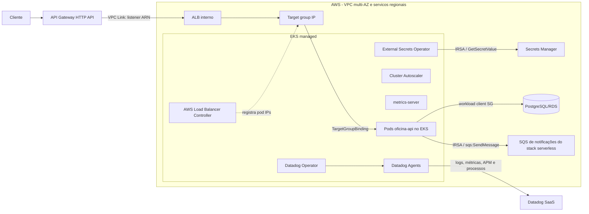

# Oficina — infraestrutura Kubernetes e observabilidade

Infraestrutura GitHub-ready do Tech Challenge Fase 3. Este repositório cria a fundação AWS/EKS, instala os controladores de plataforma e gerencia o dashboard e os alertas no Datadog. Nenhum valor de segredo é versionado ou persistido em state: apenas ARNs e nomes de Kubernetes Secrets fazem parte dos contratos Terraform.

## Escopo

O repositório é dividido em três states independentes para evitar dependência circular entre o EKS e os providers Kubernetes/Helm:

| Stack | Responsabilidade |
| --- | --- |
| `aws/` | VPC multi-AZ, subnets públicas/privadas, NAT configurável, EKS, node groups, ECR, ALB interno, listener e target group IP |
| `platform/` | IRSA dos controladores e do ServiceAccount `oficina-api`, EBS CSI, AWS Load Balancer Controller, metrics-server, Cluster Autoscaler, External Secrets Operator e Datadog Operator/Agent |
| `observability/` | Dashboard, cinco monitores de métricas e um Synthetic de readiness/uptime no Datadog |

Os quatro repositórios da solução têm responsabilidades separadas:

1. `oficina-api`: aplicação NestJS, container, manifests/chart e instrumentação APM/métricas de negócio.
2. `oficina-auth-serverless`: autenticação serverless e API Gateway HTTP API.
3. `oficina-infra-kubernetes`: este repositório, responsável pela plataforma EKS e Datadog.
4. `oficina-infra-database`: PostgreSQL/RDS, segurança, backup e integração de rede.

## Arquitetura



### Contratos entre repositórios

O stack `aws` exporta:

- `private_integration_contract.listener_arn`: URI da integração privada do API Gateway HTTP API via VPC Link;
- `private_integration_contract.private_subnet_ids`: subnets do VPC Link;
- `private_integration_contract.target_group_arn`: referência do `TargetGroupBinding` criado pelo chart do `oficina-api`;
- `backend_listener_arn`, `vpc_link_security_group_ids` e `lambda_security_group_ids`: aliases de compatibilidade consumidos pelo repositório de autenticação/API Gateway;
- `workload_client_security_group_id`: source SG que o repositório de banco libera na porta 5432;
- The internal ALB accepts the dedicated VPC Link SG only; Lambda and EKS workload SGs cannot bypass API Gateway. Keep `alb_ingress_cidrs=[]` except for a reviewed break-glass source.
- `ecr_repository_url`: destino da imagem produzida no pipeline da aplicação;
- `cluster_name`, endpoint, CA e OIDC: consumidos pelo stack `platform`.
O stack `platform` recebe `notification_queue_arn` e publica `application_notification_contract` com namespace `oficina`, ServiceAccount `oficina-api`, role ARN e queue ARN. O chart da aplicação usa esse role ARN na anotação IRSA e a queue URL exportada pelo stack serverless para produzir eventos.

O ALB é criado diretamente pelo Terraform, sempre interno. O AWS Load Balancer Controller não cria outro ALB: ele reconcilia o `TargetGroupBinding` da aplicação e registra os IPs dos pods no target group existente.

## Pré-requisitos

- Terraform `1.16.0` (mínimo aceito: `1.10`, necessário para lockfile nativo do backend S3);
- AWS CLI v2, Helm 3 e `kubectl` para operação local;
- bucket S3 de state previamente criado, com versionamento, criptografia, bloqueio público e lockfile nativo do backend S3;
- role IAM de GitHub Actions com trust OIDC limitado a este repositório, branches e GitHub Environments;
- três segredos já existentes no AWS Secrets Manager (banco, JWT e Datadog);
- fila SQS criada por `oficina-auth-serverless` com notificações habilitadas; informe seu ARN em `notification_queue_arn`;
- organização Datadog e, para testar o ALB interno, uma Datadog Synthetic Private Location com conectividade à VPC.

O padrão é EKS `1.35`, configurável. Em 31/08/2026 o EKS também oferece `1.36`, porém o chart oficial estável do Cluster Autoscaler `9.59.0` ainda publica o app `1.35.0`. O minor do Autoscaler deve ser igual ao minor do Kubernetes; o `check` Terraform impede uma combinação divergente. Atualize os dois valores juntos quando o chart oficial compatível for publicado.

## Secrets Manager e External Secrets

Os segredos são provisionados fora deste repositório. O Terraform recebe somente os ARNs:

| Variável | JSON esperado | Ownership/consumo |
| --- | --- | --- |
| `database_secret_arn` | propriedade `url` com a URL Prisma/TLS | O chart do `oficina-api` cria o `ExternalSecret` da aplicação |
| `jwt_secret_arn` | propriedades `secret` e `refreshSecret` | O chart do `oficina-api` cria o mesmo `ExternalSecret` da aplicação |
| `datadog_secret_arn` | `api_key` e `app_key` | Este stack cria `datadog/datadog-secret`, com chaves `api-key` e `app-key` |

Exemplo apenas de estrutura — os valores reais devem ser inseridos diretamente no Secrets Manager:

```json
{
  "url": "REDACTED"
}
```

```json
{
  "secret": "REDACTED",
  "refreshSecret": "REDACTED"
}
```

O stack `platform` instala o ESO, cria somente o `ClusterSecretStore/aws-secrets-manager` e o `ExternalSecret` do Datadog. O `ExternalSecret/oficina-api` e seu Secret alvo pertencem exclusivamente ao chart do repositório `oficina-api`; ele deve referenciar o mesmo store e passar os segredos de banco/JWT acima. Isso evita dois releases disputando o mesmo recurso Kubernetes.

O papel IRSA do ESO recebe `secretsmanager:GetSecretValue` somente para os três ARNs e para `additional_external_secret_arns`. Quando os segredos usam CMK, informe `external_secrets_kms_key_arns`. O output `irsa_contract` publica nome, namespace e role ARN de cada service account; `external_secrets_contract` publica o store, ownership e ARNs permitidos.

Nos GitHub Environments, `EXTERNAL_SECRETS_KMS_KEY_ARNS_JSON` deve listar as CMKs desses segredos (ou `[]` quando usam a chave gerenciada), para que o workflow configure o IRSA sem permissões implícitas.

O pipeline também lê temporariamente `api_key` e `app_key` do mesmo segredo para autenticar o provider Datadog. Os valores são mascarados e exportados apenas para o processo do runner; não existem GitHub Secrets de Datadog e as chaves não entram no Terraform state.

## Notificações serverless e IRSA da aplicação

O stack `platform` não cria o ServiceAccount da aplicação; ele cria somente a role IAM confiável para `system:serviceaccount:oficina:oficina-api`. A policy permite exclusivamente `sqs:SendMessage` no ARN informado, sem wildcard e sem permissões no role geral dos nodes.

O chart `oficina-api` deve criar esse ServiceAccount com a anotação `eks.amazonaws.com/role-arn`, definir `NOTIFICATION_QUEUE_URL` com o output do repositório serverless e publicar a mensagem com o atributo `correlation_id`. O output `application_notification_contract` é a fonte do role ARN e do vínculo exato.

## Datadog no cluster

O chart oficial do Datadog Operator cria as CRDs. O chart local aplica um `DatadogAgent` `datadoghq.com/v2alpha1` que habilita:

- logs de containers e detecção automática de multiline;
- APM por Unix Domain Socket e host port;
- DogStatsD por Unix Domain Socket e UDP/8125;
- live processes, process discovery e live containers;
- Kubernetes events, Orchestrator Explorer e kube-state-metrics core;
- admission controller em modo `hostip`, que injeta `DD_AGENT_HOST` para o cliente UDP `hot-shots` da API; UDS continua disponível para clientes compatíveis;
- tags globais `env` e `team`;
- `service` e `version` somente nos pods via Unified Service Tagging, evitando marcar controllers e Agents como `service:oficina-api`.

Como `mutateUnlabelled` é `false`, o Deployment da aplicação deve declarar os labels abaixo no pod template. O admission controller injeta os endpoints do Agent e as unified service tags:

```yaml
metadata:
  labels:
    admission.datadoghq.com/enabled: "true"
    tags.datadoghq.com/env: homolog
    tags.datadoghq.com/service: oficina-api
    tags.datadoghq.com/version: "<sha-ou-semver>"
```

### Contrato de métricas

O dashboard e os monitores esperam que `oficina-api` emita via DogStatsD:

| Métrica | Tipo | Tags mínimas |
| --- | --- | --- |
| `oficina.api.request.duration_ms` | DISTRIBUTION, milissegundos | `env`, `service`, `method`, `status_code` |
| `oficina.service_orders.created` | COUNT | `env`, `service` |
| `oficina.service_orders.status_duration_ms` | DISTRIBUTION, milissegundos | `env`, `service`, `status:diagnostico|execucao|finalizacao` |
| `oficina.service_orders.processing_errors` | COUNT | `env`, `service`, `operation` |
| `oficina.integrations.errors` | COUNT | `env`, `service`, `integration` |

Os widgets p50/p95/p99 e o monitor de latência usam diretamente a distribuição `oficina.api.request.duration_ms`, com limiares em milissegundos. O APM permanece habilitado no Agent para traces distribuídos, sem acoplar alertas ao nome interno de um span do framework.

## Dashboard e alertas

O stack `observability` cria um dashboard com volume diário de OS, média e p95 da distribuição dos tempos de diagnóstico, execução e finalização por status, erros de integração, p50/p95/p99 da API e CPU/memória por pod.

Alertas gerenciados:

- p95 de latência da API;
- CPU por pod;
- working set de memória em relação ao limite;
- falhas no processamento de OS;
- erros de integrações externas;
- Synthetic HTTP do `/api/health/ready`, que constitui o monitor de saúde/uptime.

O Synthetic deve usar uma Private Location para o endpoint interno. `api_base_url` precisa resolver e ser alcançável a partir dessa location.

## Uso local

Cada stack possui `backend.hcl.example`, `terraform.tfvars.example` e exemplos específicos em `environments/`.

```bash
cp aws/backend.hcl.example aws/backend.hcl
cp aws/environments/homolog.tfvars.example aws/terraform.tfvars
terraform -chdir=aws init -backend-config=backend.hcl
terraform -chdir=aws plan
terraform -chdir=aws apply

cp platform/backend.hcl.example platform/backend.hcl
cp platform/environments/homolog.tfvars.example platform/terraform.tfvars
terraform -chdir=platform init -backend-config=backend.hcl
terraform -chdir=platform plan
terraform -chdir=platform apply

export DD_API_KEY="$(aws secretsmanager get-secret-value --secret-id '<datadog-secret-arn>' --query SecretString --output text | jq -r .api_key)"
export DD_APP_KEY="$(aws secretsmanager get-secret-value --secret-id '<datadog-secret-arn>' --query SecretString --output text | jq -r .app_key)"
cp observability/backend.hcl.example observability/backend.hcl
cp observability/environments/homolog.tfvars.example observability/terraform.tfvars
terraform -chdir=observability init -backend-config=backend.hcl
terraform -chdir=observability plan
terraform -chdir=observability apply
unset DD_API_KEY DD_APP_KEY
```

### Ordem de bootstrap entre repositórios

1. Aplique somente `aws/` para criar VPC, EKS, ECR, ALB e os contratos de rede.
2. Aplique `oficina-infra-database` usando VPC, subnets e SG exportados; obtenha o secret ARN do banco.
3. Crie/registre os segredos JWT e Datadog no Secrets Manager.
4. Aplique `oficina-auth-serverless` com `notification_enabled=true`; obtenha `notification_queue_arn`/`notification_queue_url` e a URL do API Gateway.
5. Aplique `platform/` com os três secret ARNs e `notification_queue_arn`; obtenha `application_notification_contract.role_arn`.
6. Configure o chart/pipeline de `oficina-api` com o role ARN, a queue URL, cluster/ECR, target group e nomes dos segredos; então faça o rollout.
7. Aplique `observability/` na fase 1 com `manage_metric_tag_configuration=false`.
8. Gere tráfego real até as cinco métricas customizadas aparecerem no Datadog.
9. Execute a fase 2 de metric tags somente no state autoritativo, conforme o procedimento abaixo.

Para remoção controlada, interrompa produtores, remova observabilidade/aplicação e só então desfaça platform, serverless, banco e fundação AWS. Revise sempre o plano e as proteções de produção antes de qualquer destroy.

## CI/CD e GitHub Environments

Os workflows executam `fmt`, `validate`, TFLint e Checkov em PR. PRs internos também geram plano com OIDC. Push em `homolog` aplica no Environment `homolog`; push em `main` aplica no Environment `production`.

Configure estas variables em cada GitHub Environment:

| Variable | Exemplo/finalidade |
| --- | --- |
| `AWS_ROLE_ARN`, `AWS_REGION` | role OIDC de deploy e região |
| `VPC_CIDR` | CIDR exclusivo do ambiente, por exemplo `10.20.0.0/16` |
| `MANAGED_NODE_GROUPS_JSON` | mapa HCL/JSON com instance types e `min_size`, `max_size`, `desired_size` |
| `CLUSTER_ENDPOINT_PUBLIC_ACCESS` | `false` com runner privado; `true` somente quando necessário |
| `CLUSTER_ENDPOINT_PUBLIC_ACCESS_CIDRS_JSON` | lista JSON de CIDRs aprovados, por exemplo `["203.0.113.10/32"]` |
| `TF_STATE_BUCKET`, `TF_STATE_REGION` | backend compartilhado |
| `TF_AWS_STATE_KEY` | `oficina/homolog/aws.tfstate` |
| `TF_PLATFORM_STATE_KEY` | `oficina/homolog/platform.tfstate` |
| `TF_OBSERVABILITY_STATE_KEY` | `oficina/homolog/observability.tfstate` |
| `DATABASE_SECRET_ARN`, `JWT_SECRET_ARN`, `DATADOG_SECRET_ARN` | ARNs existentes no Secrets Manager; nunca valores dos segredos |
| `NOTIFICATION_QUEUE_ARN` | ARN da fila exportada por `oficina-auth-serverless`; usado somente para a policy `sqs:SendMessage` do IRSA da aplicação |
| `DATADOG_SITE`, `DATADOG_API_URL` | site e endpoint correspondentes da organização Datadog |
| `ENABLE_AWS_INTEGRATION` | `true` em exatamente um state por conta AWS; cria a integração account-level e o papel IAM de leitura |
| `AWS_INTEGRATION_ROLE_NAME`, `AWS_INTEGRATION_NAMESPACES_JSON` | nome do papel e namespaces CloudWatch; padrão: API Gateway, Lambda e RDS |
| `MANAGE_DATADOG_METRIC_TAGS` | comece com `false`; use `true` na fase 2, em exatamente um state por organização e só após as métricas existirem |
| `KUBERNETES_CLUSTER_NAME` | `oficina-homolog-eks` |
| `API_BASE_URL` | URL alcançável pela Private Location |
| `SYNTHETICS_LOCATIONS_JSON` | lista JSON, por exemplo `["pl:abc-def"]` |
| `ENABLE_PLATFORM`, `ENABLE_OBSERVABILITY` | `true` após o bootstrap de cada dependência |
| `TF_RUNNER` | label de runner com conectividade ao endpoint EKS privado; vazio usa `ubuntu-latest` |

Exemplo de `MANAGED_NODE_GROUPS_JSON` para homologação:

```json
{"general":{"instance_types":["m7i.large"],"capacity_type":"SPOT","min_size":1,"max_size":4,"desired_size":2,"disk_size":50,"labels":{"workload":"general"}}}
```


### Bootstrap Datadog em duas fases

A chave de aplicação armazenada em `datadog_secret_arn` precisa da permissão `metric_tags_write` para a fase 2, além das permissões necessárias para dashboard, monitores, Synthetic e integração AWS. Mantenha a chave com escopo mínimo e separada da API key de ingestão.

Na fase 1, mantenha `MANAGE_DATADOG_METRIC_TAGS=false`, aplique dashboard/monitores/integração e gere tráfego até as cinco métricas aparecerem no Metrics Explorer. A configuração de tags de uma métrica só deve ser criada depois que a própria métrica existir.

Se ainda não houver configuração global para essas métricas, altere a variável para `true` somente no state autoritativo e aplique novamente. Se alguma configuração já existir, importe-a antes da fase 2:

```bash
terraform -chdir=observability import 'datadog_metric_tag_configuration.api_request_duration[0]' oficina.api.request.duration_ms
terraform -chdir=observability import 'datadog_metric_tag_configuration.service_order_created[0]' oficina.service_orders.created
terraform -chdir=observability import 'datadog_metric_tag_configuration.service_order_status_duration[0]' oficina.service_orders.status_duration_ms
terraform -chdir=observability import 'datadog_metric_tag_configuration.service_order_processing_errors[0]' oficina.service_orders.processing_errors
terraform -chdir=observability import 'datadog_metric_tag_configuration.integration_errors[0]' oficina.integrations.errors
```

Nunca habilite `MANAGE_DATADOG_METRIC_TAGS` em mais de um Environment da mesma organização. O procedimento e os IDs de import seguem o recurso oficial [`datadog_metric_tag_configuration`](https://registry.terraform.io/providers/DataDog/datadog/latest/docs/resources/metric_tag_configuration).

### Integração AWS: tags, external ID e import

`account_tags` é aplicado a todas as métricas provenientes da conta AWS; por isso usa apenas `team:oficina` e `managed-by:terraform`. `env`, `service` e `version` permanecem nas tags dos recursos e workloads e não são adicionadas globalmente pela integração.

Em uma instalação nova, `datadog_integration_aws_external_id` e `datadog_integration_aws_account` são criados no mesmo apply. O external ID gerado precisa ser usado para criar a integração em até 48 horas. Se expirar antes da conclusão, gere outro e reaplique:

```bash
terraform -chdir=observability apply -replace='datadog_integration_aws_external_id.oficina[0]'
```

Se a conta já estiver integrada ao Datadog, não crie uma duplicata. Importe o external ID atual e o AWS Account Config ID retornado pela API de listagem de integrações; importe também role/policy IAM existentes nos respectivos addresses ou escolha um nome de role novo antes do plan:

```bash
terraform -chdir=observability import 'datadog_integration_aws_external_id.oficina[0]' '<external-id-atual>'
terraform -chdir=observability import 'datadog_integration_aws_account.oficina[0]' '<datadog-aws-account-config-id>'
```

Consulte os recursos oficiais [`datadog_integration_aws_external_id`](https://registry.terraform.io/providers/DataDog/datadog/latest/docs/resources/integration_aws_external_id) e [`datadog_integration_aws_account`](https://registry.terraform.io/providers/DataDog/datadog/latest/docs/resources/integration_aws_account) antes de importar ou regenerar o vínculo.

O Environment `production` deve exigir aprovação e aceitar deploy somente de `main`. Para endpoint EKS privado, use runner self-hosted na VPC. Se homologação usar runner hospedado, habilite temporariamente o endpoint público somente para CIDRs aprovados — nunca `0.0.0.0/0`.

Nos variables do Environment `production`, use chaves de state novas como `oficina/production/aws.tfstate`, `oficina/production/platform.tfstate` e `oficina/production/observability.tfstate`. A tag unificada canônica é `env:production` em todos os quatro repositórios; `prod` não é aceito.

## Swagger / OpenAPI

N/A para este repositório: ele não publica uma API. O contrato compartilhado pertence ao [`oficina-api`](https://github.com/christochula/oficina-api) e é servido em `/api/docs` (localmente, `http://localhost:3000/api/docs`). As URLs de homologação/produção devem usar o hostname do API Gateway e manter o mesmo path; não há cópia do Swagger nesta infraestrutura.

## Decisões de segurança e custo

- subnets privadas hospedam EKS, pods e ALB; subnets públicas hospedam apenas o caminho de NAT;
- NAT `single` reduz custo em homologação; `per_az` remove o ponto único de falha em produção;
- API do EKS é privada por padrão, com public access opt-in e CIDRs explícitos;
- control-plane logs e VPC Flow Logs estão habilitados;
- Secrets do EKS são criptografados com KMS e o ECR faz scan on push;
- IRSA evita permissões AWS no role geral dos nodes;
- ALB ingress limita-se ao CIDR da VPC por padrão e o egress limita-se ao SG/porta da aplicação;
- exemplos de produção habilitam deletion protection e tags ECR imutáveis.

Antes de produção, forneça certificado ACM em `alb_certificate_arn`, integre ALB access logs ao bucket corporativo e revise os skips documentados em `.checkov.yml` com a política da organização.
